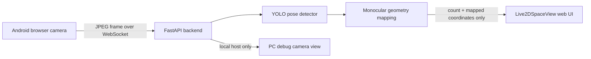

# Live2DSpaceView

Android camera footage is processed with YOLO pose estimation and monocular geometry, then visualized as privacy-preserving 2D space mapping. The public web UI only shows the number of detected people and their mapped positions; the raw camera/debug view is available only from the local PC.


## What It Shows

- YOLO pose detection for people from a monocular Android camera stream.
- MonoLoco-inspired position estimation from 2D joints, foot anchors, body height, and camera intrinsics.
- Bird's-eye-view mapping with per-person IDs and simple future trajectory hints.
- Privacy-first frontend: camera pixels are hidden from the public UI.
- Local-only debug view at `http://127.0.0.1:8000/debug` for checking boxes, joints, anchors, and estimated coordinates on the PC.

## Architecture



## Quick Start

Requirements:

- Python with `uv`
- Node.js and npm
- A webcam or Android browser camera

Build the frontend:

```bash
cd frontend
npm install
npm run build
```

Start the backend:

```bash
cd ../backend
uv sync
uv run main.py
```

Open the app:

```text
http://127.0.0.1:8000
```

Open the local debug camera view on the PC:

```text
http://127.0.0.1:8000/debug
```

Preview the UI without a camera:

```text
http://127.0.0.1:8000/?demo=1
```

## Android Camera Setup

Landscape is recommended for normal room-scale mapping because it captures a wider horizontal area and keeps multiple people in frame. Portrait can work in narrow corridors or when the camera is close, but the estimator works best when each person's head and feet are visible.

When exposing the local backend to an Android phone, use a tunnel such as Cloudflare Tunnel and open the generated HTTPS URL on the phone. Quick Tunnel URLs are temporary, so regenerate the URL when the tunnel process stops.

## Configuration

The backend works without manual calibration, but accuracy improves when camera values are provided:

| Variable | Purpose |
| --- | --- |
| `CAMERA_FX`, `CAMERA_FY` | Camera focal length in pixels |
| `CAMERA_CX`, `CAMERA_CY` | Principal point in pixels |
| `HUMAN_HEIGHT_M` | Assumed human height, default `1.70` |
| `BEV_HOMOGRAPHY` | Optional 3x3 image-to-floor homography |
| `YOLO_POSE_MODEL` | Local YOLO pose model path |
| `DEBUG_BROWSER_WINDOW` | Set `0` to stop auto-opening the PC debug view |
| `DEBUG_CAMERA_WINDOW` | Set `1` to try native OpenCV `cv2.imshow` |

## What Is Committed

This repository intentionally includes source code, configuration, lock files, documentation, and screenshots.

It intentionally excludes runtime logs, `.env` files, virtual environments, frontend build output, local tunnel logs, YOLO weights, and model checkpoints. Those files can contain local paths, temporary URLs, machine-specific output, or large binary artifacts that do not belong in a portfolio repository.

## Project Notes

The bundled MonoTransmotion reference is used as research context. The running system uses a lightweight YOLO-pose geometry wrapper so it can produce coordinates without requiring unpublished training checkpoints.
