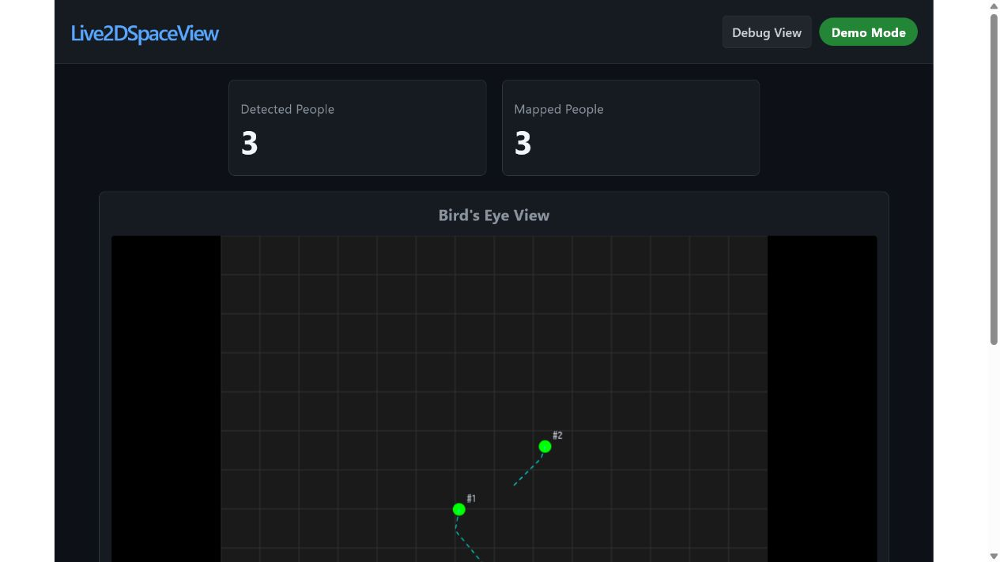
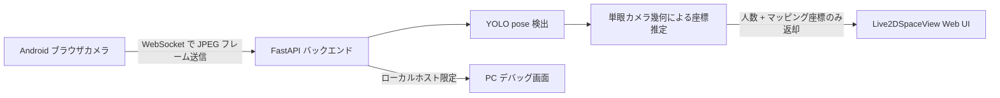

# Live2DSpaceView

Android のカメラ映像を YOLO の姿勢推定と単眼カメラ幾何で解析し、人物の位置を 2D 空間上にマッピングするシステムです。公開用の Web UI にはカメラ映像を表示せず、検出人数とマッピング結果だけを表示します。生のカメラ映像や関節検出の様子は、PC ローカル専用のデバッグ画面で確認できます。



## できること

- Android ブラウザの単眼カメラ映像から YOLO pose で人物を検出します。
- 2D 関節、足元アンカー、人物の見かけ上の高さ、カメラ内部パラメータを使い、MonoLoco に着想を得た距離推定を行います。
- 人物ごとの ID、現在位置、簡易的な移動予測を俯瞰マップに表示します。
- 公開 UI にはカメラ映像を出さず、人数と座標情報だけを返すプライバシー重視の構成です。
- PC ローカル限定の `http://127.0.0.1:8000/debug` では、検出枠、関節点、足元アンカー、推定座標を確認できます。

## システム構成



## セットアップ

必要なもの:

- Python と `uv`
- Node.js と npm
- Web カメラ

フロントエンドをビルドします。

```bash
cd frontend
npm install
npm run build
```

バックエンドを起動します。

```bash
cd ../backend
uv sync
uv run main.py
```

アプリを開きます。

```text
http://127.0.0.1:8000
```

PC でローカル専用のデバッグ画面を開きます。

```text
http://127.0.0.1:8000/debug
```

カメラなしで UI を確認したい場合は、デモモードを使えます。

```text
http://127.0.0.1:8000/?demo=1
```

## Android カメラの向き

通常の部屋サイズのマッピングでは、横向きがおすすめです。横向きの方が水平方向に広く撮影でき、複数人を同時にフレームへ入れやすいためです。

縦向きは、廊下のように細長い空間や、カメラと人物の距離が近い場合には有効です。どちらの向きでも、頭から足元までが映っているほど推定精度が安定します。

Android 端末からローカルバックエンドへ接続する場合は、Cloudflare Tunnel などで HTTPS URL を発行し、その URL を Android 側で開きます。Quick Tunnel の URL は一時的なものなので、トンネルを止めた場合は再発行してください。

## 設定項目

手動キャリブレーションなしでも動作しますが、実カメラの値を指定すると座標推定の精度が上がります。

| 変数 | 用途 |
| --- | --- |
| `CAMERA_FX`, `CAMERA_FY` | カメラの焦点距離をピクセル単位で指定 |
| `CAMERA_CX`, `CAMERA_CY` | カメラの主点をピクセル単位で指定 |
| `HUMAN_HEIGHT_M` | 想定する人物身長。デフォルトは `1.70` |
| `BEV_HOMOGRAPHY` | 任意の 3x3 画像座標から床面座標へのホモグラフィ |
| `YOLO_POSE_MODEL` | ローカルの YOLO pose モデルパス |
| `DEBUG_BROWSER_WINDOW` | `0` にすると PC デバッグ画面の自動起動を止めます |
| `DEBUG_CAMERA_WINDOW` | `1` にすると OpenCV の `cv2.imshow` 表示を試します |

## モデル読み込み

バックエンドでは `YOLO_POSE_MODEL` に指定されたパスから YOLO pose モデルを読み込みます。指定がない場合は `backend/yolov8n-pose.pt` を優先し、見つからない場合は Ultralytics の `yolov8n-pose.pt` 名で読み込みます。

モデルの重みファイルは容量が大きくなりやすいため、Git には含めていません。実行環境ごとにローカルへ配置するか、Ultralytics の標準モデルを利用する構成にしています。

## 補足

同梱している MonoTransmotion は研究背景の参照として扱っています。実際に動作する本システムでは、未公開の学習済みチェックポイントに依存せず座標を出せるよう、YOLO pose と軽量な幾何推定ラッパーを使っています。
